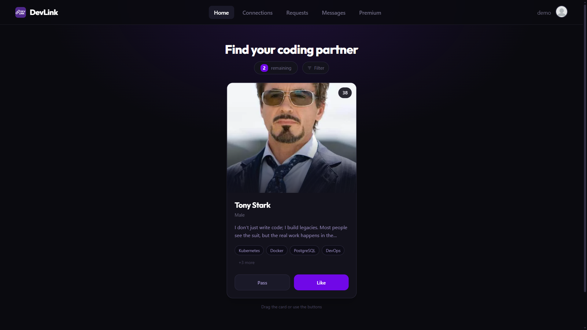
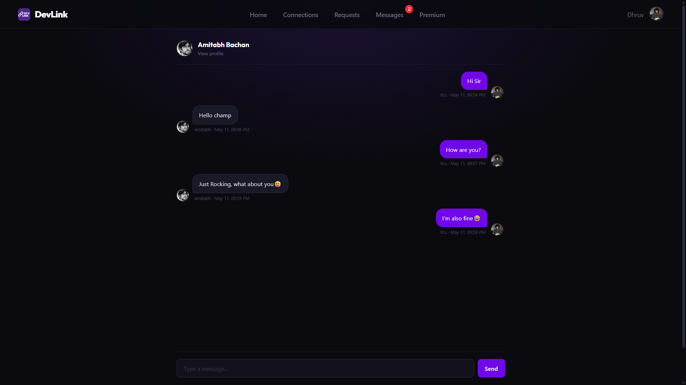
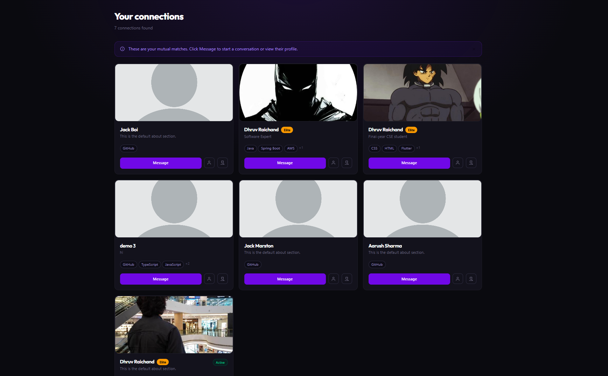

# DevLink — Frontend

React frontend for a developer discovery and networking platform. Swipe-based profile browsing, real-time chat, online presence indicators, and live connection request notifications.

**Live:** [linkdev.online](https://linkdev.online) &nbsp;·&nbsp; **Backend:** [devlink-backend](https://github.com/Dhruv-Raichand/devlink-backend)

---





---

## Tech stack

|           |                     |
| --------- | ------------------- |
| Framework | React 19 + Vite     |
| Styling   | Tailwind CSS v4     |
| State     | Redux Toolkit       |
| Routing   | React Router v7     |
| Real-time | Socket.io client    |
| HTTP      | Axios (cookie auth) |
| Payments  | Razorpay            |

---

## Features

**Swipe feed** — draggable card stack with green/red overlay on drag. Fetches 5 profiles at a time, auto-fetches more when ≤ 2 cards remain. Skill-based filtering via `?skills=React,Node.js`. Pagination uses refs (`pageRef`, `isFetchingRef`, `hasMoreRef`) to avoid stale-closure re-render loops.

**Real-time notifications** — Socket.io listener in `Layout.jsx` dispatches to Redux on `newNotification`. NavBar badge counts are derived via `useMemo` and clear automatically when the user visits the relevant page.

**Online presence** — on socket `register`, the server returns an `onlineList` snapshot so the UI is accurate immediately. Green dot in `ChatInbox`, "Active" badge in `Connections` grid.

**Connection requests** — send, accept, reject, withdraw. Accepted requests fire a `request_accepted` notification to the original sender.

**Real-time chat** — Socket.io room per conversation pair (deterministic hash). Messages persisted to MongoDB and fetched on mount.

**Onboarding** — 4-step full-page flow on first signup. Skill chips, custom gender pills (no native `<select>`), GitHub username. Completion flag in `localStorage`.

**Premium** — Razorpay order integration with payment polling.

**GitHub integration** — fetches `api.github.com/users/:username` on profile pages. Shows repos, followers, bio.

---

## State slices

| Slice               | What it holds                                    |
| ------------------- | ------------------------------------------------ |
| `userSlice`         | Logged-in user                                   |
| `feedSlice`         | Feed profiles (`initialState: []`, never `null`) |
| `connectionSlice`   | Accepted connections                             |
| `requestSlice`      | Received requests                                |
| `skillsSlice`       | Predefined skills + `loaded` flag                |
| `notificationSlice` | In-session notifications (badge source)          |
| `onlineSlice`       | Array of currently-online user IDs               |

---

## Real-time flow

```
Layout mounts (user logged in)
  └── socket.emit("register", user._id)
        ├── server → "onlineList"      → dispatch(setOnlineList)
        └── server → "userOnline"      → dispatch(setOnline)

socket.on("userOffline")               → dispatch(setOffline)

socket.on("newNotification")
  ├── type "message"          → dispatch(addNotification) + toast
  ├── type "request"          → dispatch(addNotification) + toast
  └── type "request_accepted" → dispatch(addNotification) + toast

User visits /app/messages              → dispatch(clearByType("message"))
User visits /app/requests              → dispatch(clearByType("request"))
```

---

## Routes

| Path                          | Page                            |
| ----------------------------- | ------------------------------- |
| `/`                           | Landing                         |
| `/login`                      | Login / signup (tab toggle)     |
| `/app`                        | Feed                            |
| `/app/onboarding`             | Onboarding (4 steps)            |
| `/app/connections`            | Connections grid                |
| `/app/requests`               | Requests (tab persisted in URL) |
| `/app/messages`               | Chat inbox                      |
| `/app/messages/:targetUserId` | Conversation                    |
| `/app/profile`                | Own profile + edit              |
| `/app/profile/:userId`        | Other user's profile            |
| `/app/premium`                | Pricing + payment               |

---

## Setup

```bash
git clone https://github.com/Dhruv-Raichand/devlink-frontend.git
cd devlink-frontend && npm install
cp .env.example .env
npm run dev
```

```env
VITE_BASE_URL=http://localhost:3000
```

```bash
npm run dev      # Vite dev server
npm run build    # Production build
npm run lint     # ESLint
```

---

_[Dhruv Raichand](https://github.com/Dhruv-Raichand) · DevLink © 2026_
